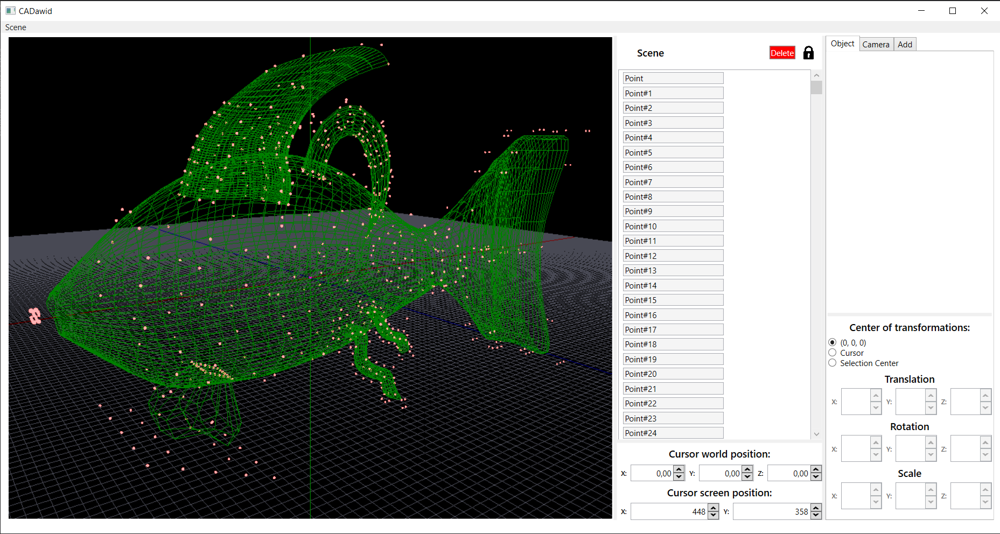

# Simple CAD program implementation

## Project Background

This project was developed as part of the "Geometric Modelling" course during the master's degree program in "CAD/CAM Systems Design" at the Faculty of Mechatronics, Warsaw University of Technology.

The task centered around creating a segment of CAD functionality. The developed feature allows for modelling with curves and patches (both C0 and C2 continuity).

## Functionality & Application

The CAD functionality implemented in this project proves instrumental in designing complex 3D models for the game environment and characters. It employs the concept of curve and patch modelling, offering the flexibility of C0 and C2 continuity. This level of detail aids in creating intricate and realistic models, enhancing the overall gaming experience.

As a testament to the functionality's application, a model of a fish was created using this feature, also serving as an assessment element for the course. 

## From Virtual Model to Physical Object

The fish model was not only designed but also brought to life as a physical object. Post-design, I prepared detailed instructions for a milling machine to carve the model out of wood. The resulting wooden model served as a tangible testament to the precision and effectiveness of the CAD functionality implemented in the project.

## Technologies

The development of this CAD modelling feature was facilitated by a variety of technologies:

- **C#**: The primary programming language used for the development of this feature.
- **WPF**: Windows Presentation Foundation (WPF) was used to create the desktop application interface, providing a user-friendly and efficient means of interaction with the feature.
- **SharpDX**: Used for handling the graphics part of the application, allowing for the smooth rendering and display of the 3D models.

## CAD Model Screenshot

The screenshot below presents the model of a fish created using the CAD modelling feature implemented in the project.

## Wooden Model Photograph

The photograph below showcases the wooden model of the fish, a tangible product of the CAD modelling functionality.

## Usage & Contribution

I invite you to explore the repository and provide feedback or contributions to improve the CAD modelling functionality of "CADawid".

## Contributing

Contributions from the community are welcome. If you're interested in contributing, please follow these steps:

1. Fork the repository
2. Create your feature branch: `git checkout -b feature/YourFeature`
3. Commit your changes: `git commit -am 'Add some feature'`
4. Push to the branch: `git push origin feature/YourFeature`
5. Submit a pull request

## License

This project is licensed under the [MIT License](LICENSE).
